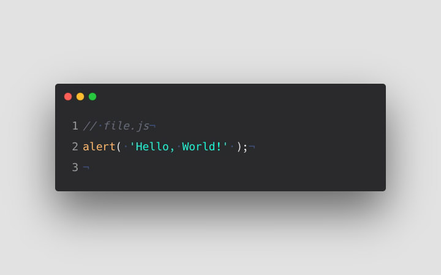

<h1 align="center">👋🏾 Welcome to My World — I'm Chibuikem Lucas</h1>

  <em>Full-Stack Dev | React, Express & Node Specialist | Creative UI Animator with strong and secure Backend | 3D Web Magician</em>

  

---

### 🚀 About Me

I'm **Chibuikem Lucas**, a full-stack developer from Nigeria who’s obsessed with crafting immersive and high-performance web and mobile experiences. My specialty? Making UIs that *move*, *react*, and *wow*, still coming along with a well-structured and secure backend framework.  

I have 2 years of experience building full-stack applications,I'm currently on a journey to **apply my knowledge and learn more full-stack technologies** and push creative boundaries by **creating innovative 3D fullstack apps that solve key problems** using:

  
  
  
  
  
  
  

---

### 💼 What I'm Doing Now

- 🛠️ Building **real-world full-stack projects** that solve real problems or make it easier to do certain mundane tasks.  
- 🌍 Growing my network and looking for **collaborations and job offers**  
- 🔥 Sharing my dev journey and insights online  

---

### 📚 JavaScript Series on Hashnode

> I'm documenting everything I'm learning in-depth as I revisit core JavaScript concepts — practical, modern, and beginner-friendly.

<table align="center">
  <tr>
  <!-- Chapter 1 -->
    <td align="center">
  
   
  <strong><a href="https://javascriptseries.hashnode.dev/episode-1-what-is-javascript" target="_blank">📘 Chapter 1 – What is JavaScript?</a></strong>
</td>

 

  <!-- Chapter 2 -->
  <td align="center">
  
   
  <strong><a href="https://javascriptseries.hashnode.dev/episode-2-your-first-hello-world" target="_blank">📙 Chapter 2 – Your First Hello World</a></strong>
  </td>
</tr>
</table>
 

  👉 Read the full series at <a href="https://javascriptseries.hashnode.dev" target="_blank"><strong>javascriptseries.hashnode.dev</strong></a>

---

### 🤝 Open to Collaborate On:

- 🚀 Creative frontend and backend projects of any kind.
- 🧩 Open-source tools with interactive/visual components  
- 📱 React Native mobile experiences  
- 🎯 Startups or teams needing **visually stunning** interfaces and great backend features. 

---

### 📊 My GitHub Streak

  
   

---

### 📫 Contact Me

> Let's connect and build something impactful:

  

---

> 🧩 *“Great software is built like art — with soul, structure, and story.”*
